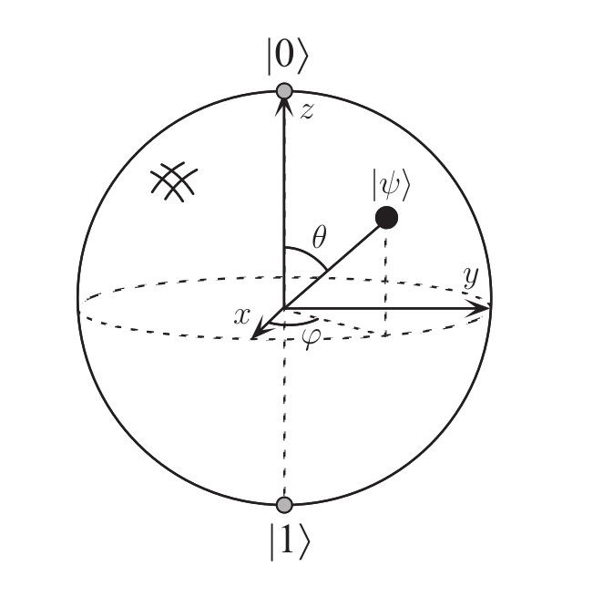

### Bloch球

单量子比特可以使用Bloch球表示

$$
|\psi\rangle=\cos \frac{\theta}{2}|0\rangle+ e^{i \varphi} \sin \frac{\theta}{2}|1\rangle
$$

### 计算复杂度

P:可以用经典计算机快速解决的问题

NP:可以用经典计算机快速验证的问题

BPP:可以利用随机算法在一定误差概率限制下快速解决的问题

BQP:可以利用量子计算机在一定误差概率限制下快速解决的问题

PSPACE:可以利用较少的空间资源解决的问题，对时间资源不做要求

（快速指可以在多项式时间内解决）

### 量子信息的几个基本目标

1. 辨别量子力学中静态资源的基本类别
2. 辨别量子力学中动态过程的基本类别
3. 量化进行动态处理引起的资源交换
