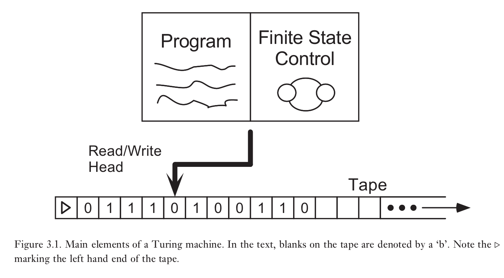
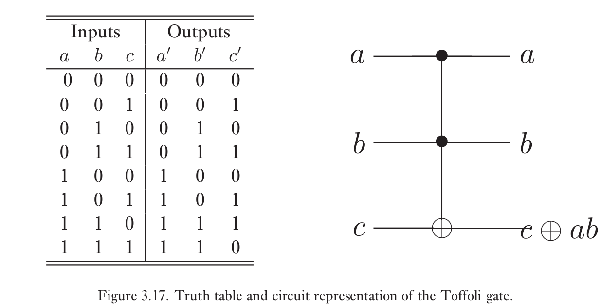

### 计算模型

#### 图灵机

图灵机有四个主要组成部分

1. 有限状态控制

   图灵机的有限状态控制由一组有限的内部状态，$$q_1,\cdots,q_m$$组成。除此之外还有两个特殊的态$$q_s,q_h$$，分别叫做开始状态和结束状态。计算开始时，图灵机处在开始状态$$q_s$$，实施计算使得图灵机的内部状态发生改变，结束时变为$$q_h$$,意味着计算完成。

2. 磁带

   图灵机的磁带单边无限。它由无限个磁带方块序列组成，编号为$$0,1,2,3.\cdots$$。每个块包含着某个包含有限个分立符号字母表$$\Gamma$$中的一个字符。

3. 磁带读写指针

4. 程序

   图灵机的程序是一个$$<q,x,q',x',s>$$格式命令行的有限有序列表。q 是图灵机的内部状态，x 是从磁带读取的数据，q ' 为图灵机执行完该条命令后变成内部状态，x' 为写入磁带的内容，s 为磁头移动

   #### 通用图灵机

   固定程序和内部状态，只有磁带的初始内容可变的图灵机可以模拟任何图灵机，与该图灵机所以时间为多项式的关系。

#### 电路

一组确定的门可以用来计算任意函数$$f:\{0,1\}^n\to\{0,1\}^m$$

### 计算问题分析

分析计算问题取决于以下三个基本问题的答案

1. 什么是计算问题？这里讨论决定性问题。
2. 怎样确定算法解决给定的计算问题？什么算法可以用，有没有通用算法，怎样确定算法按照预期进行
3. 解决给定的计算问题所需的最少资源是多少？时间，空间，能量

#### 量化计算资源

O:上界

$$\Omega$$:下界

$$\Theta$$:同阶

#### 计算复杂度

对于给定的n比特的输入，如果能够在n的多项式资源内解决，那么这个问题就是简单的，否则就是困难的。

##### 强Church–Turing论题

任何计算模型都可以被概率图灵机模拟，基本操作数最多为多项式增加。

#### 决定性问题和计算复杂度P与NP

**形式语言**是一个字母表上的某些有限长字符串的集合。一个形式语言可以包含无限多个字符串。决定性问题可以用形式语言编码

如果一个问题可以在有限k的$$TIME(n^k)$$时间内解决，那么就称之为多项式可解。$$TIME(n^k)$$中的所有语言的集合记为P

如果存在图灵机M具有以下性质，那么语言L属于NP

1. 如果$$x\in L$$,那么存在见证字符串w使得M从状态$$x-blank-w$$开始，并且在$$|x|$$的多项式时间内停止于$$q_Y$$状态。
2. 如果$$x\notin L$$,那么对于任意尝试作为见证的字符串w，都有M从状态$$x-blank-w$$开始，在$$|x|$$的多项式时间内停止于$$q_N$$状态。

类似地，可以定义coNP,将上述两条件交换

NP完全问题：最难的NP问题，若NP完全问题有多项式时间解，则P=NP

问题约化

#### 一些复杂度类

L：对数时间复杂度

P：多项式时间复杂度

NP：多项式时间内验证

PSPACE：多项式空间

EXP：指数时间复杂度
$$
\mathbf{L} \subseteq \mathbf{P} \subseteq \mathbf{N P} \subseteq \mathbf{P S P A C E} \subseteq \mathbf{E X P}
$$
尽管该关系被广泛认为是严格的，但没有任何一个式子被证明是严格成立的。不过由时间分层定理可知，$$P$$是$$EXP$$的真子集。因此上式至少有一个式子严格成立

时间分层定理：$$TIME(f(n))$$是$$TIME(f(n)\log^2(f(n)))$$的真子集

空间分层定理：$$SPACE(f(n))$$是$$SPACE(f(n)\log(f(n)))$$的真子集

MAXSNP：可以通过近似方法有效验证的问题集合

BPP(bounded-error probabilistic time): 所以具有以下特性的语言L集合：存在概率图灵机M，如果$$x\in L$$,那么M有至少$$3/4$$的概率接受x，如果$$x\notin L$$,那么M有至少$$3/4$$的概率拒绝x。这里$$3/4$$可任选大于$$1/2$$的数

#### 能量与计算

##### Landauer（第一形式）:

如果一个计算机擦除了一比特信息，那么释放到环境中的能量至少为$$k_B T\ln 2$$。$$k_B$$为玻耳兹曼常数，$$T$$为计算机环境温度

##### Landauer原则（第二形式）:

如果一个计算机擦除了一比特信息，那么环境的熵增至少为$$k_B\ln 2$$。$$k_B$$为玻耳兹曼常数

Landauer原则给出了能量消耗的下限，如果所有计算都是可逆的，那么几乎可以不消耗能量。此时能量损耗主要来自于其他物理过程，例如噪声。

这里给出两种可逆通用门

##### Fredkin门

利用撞球模型可以制造Fredkin门

真值表如下

##### Toffoli 门

