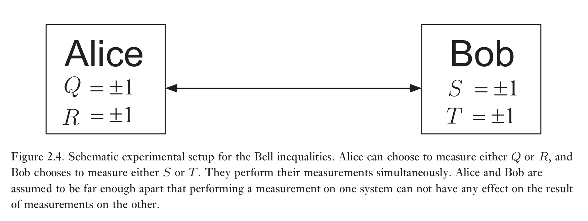

### 线性代数

#### 张量积

$$
z(|v\rangle \otimes|w\rangle)=(z|v\rangle) \otimes|w\rangle=|v\rangle \otimes(z|w\rangle)
$$

$$
\left(\left|v_{1}\right\rangle+\left|v_{2}\right\rangle\right) \otimes|w\rangle=\left|v_{1}\right\rangle \otimes|w\rangle+\left|v_{2}\right\rangle \otimes|w\rangle
$$

$$
|v\rangle \otimes\left(\left|w_{1}\right\rangle+\left|w_{2}\right\rangle\right)=|v\rangle \otimes\left|w_{1}\right\rangle+|v\rangle \otimes\left|w_{2}\right\rangle
$$

$$
(A \otimes B)(|v\rangle \otimes|w\rangle) \equiv A|v\rangle \otimes B|w\rangle
$$

$$
(A \otimes B)\left(\sum_{i} a_{i}\left|v_{i}\right\rangle \otimes\left|w_{i}\right\rangle\right) \equiv \sum_{i} a_{i} A\left|v_{i}\right\rangle\left|w_{i}\right\rangle
$$

$$
C=\sum_{i} c_{i} A_{i} \otimes B_{i}
$$

$$
\left(\sum_{i} c_{i} A_{i} \otimes B_{i}\right)|v\rangle \otimes|w\rangle \equiv \sum_{i} c_{i} A_{i}|v\rangle_{i}|w\rangle
$$

$$
\left(\sum_{i} a_{i}\left|v_{i}\right\rangle \otimes\left|w_{i}\right\rangle, \sum_{j} b_{j}\left|v_{j}^{\prime}\right\rangle \otimes\left|w_{j}^{\prime}\right\rangle\right) \equiv \sum_{i j} a_{i}^{*} b_{j}\left\langle v_{i} | v_{j}^{\prime}\right\rangle_{i}\left|w_{j}^{\prime}\right\rangle
$$

$$
\left.A\otimes B \equiv\left[\begin{array}{cccc}{A_{11} B} & {A_{12} B} & {\dots} & {A_{1 n} B} \\ {A_{21} B} & {A_{22} B} & {\dots} & {A_{2 n} B} \\ {\vdots} & {\vdots} & {\vdots} & {\vdots} \\ {A_{m 1} B} & {A_{m 2} B} & {\dots} & {A_{m n} B}\end{array} \right] \right\rbrace m p
$$

### 量子力学

#### 量子力学基本定理

1. 对于任意一个孤立的物理体系而言，都有一个与之对应，可以定义内积的矢量空间，即Hilbert空间。该空间被称为这个系统的态空间。这个体系可以被态空间中的单位矢量，态矢量完全描述。

2. 封闭量子体系的演化用酉变换描述。也就是说，$t_1$时刻系统的$|\psi\rangle$态与$t_2$时刻系统的$|\psi'\rangle$态通过一个仅依赖于时间$t_1$,$t_2$的酉算符进行关联
   $$
   |\psi'\rangle=U|\psi\rangle
   $$
   
   量子力学体系随时间的演化通过薛定谔方程描述
   
   $$
   i\hbar\frac{d|\psi\rangle}{dt}=\hat{H}|\psi\rangle
   $$

3. 量子测量通过测量算符集$\left\lbrace M_{m}\right\rbrace$描述。它们是作用在正在被测量的态空间上的算符。下标$m$代表实验中可能出现的测量结果。如果在测量前一个时刻量子体系的状态为$|\psi\rangle$，那么测量结果$m$的出现概率为
   $$
   p(m)=\langle\psi|M_m^\dagger M_m|\psi\rangle
   $$
   测量之后的量子态为
   $$
   \frac{M_m|\psi\rangle}{\sqrt{\langle\psi|M_m^\dagger M_m|\psi\rangle}}
   $$
   测量算符满足完备性条件
   $$
   \sum_{m} M_{m}^{\dagger} M_{m}=I
   $$
   
   完备性方程展示了概率和为一的事实
   $$
   1=\sum_{m} p(m)=\sum_{m}\left\langle\psi\left|M_{m}^{\dagger} M_{m}\right| \psi\right\rangle
   $$
   
4. 复合物理体系的态空间是子系统态空间的张量积

#### 投影测量

投影测量通过一个可观测量$M$描述。它是被观测系统态空间中的厄米算符。这个可观测量具有谱分解
$$
M=\sum_{m} m P_{m}
$$
式中$P_m$是投影到$M$本征空间，本征值为$m$的投影算符。测量的可能结果与可观测量的本征值$m$相关。当测量$|\psi\rangle$时，得到测量结果$m$的概率为
$$
p(m)=\left\langle\psi\left|P_{m}\right| \psi\right\rangle
$$
得到测量结果$m$后，量子体系的态立刻变为
$$
\frac{P_{m}|\psi\rangle}{\sqrt{p(m)}}
$$

#### Heisenberg不确定性原理

$$
[\Delta(M)]^{2} =\left\langle(M-\langle M\rangle)^{2}\right\rangle =\left\langle M^{2}\right\rangle-\langle M\rangle^{2}
$$

$$
\Delta(C) \Delta(D) \geq \frac{|\langle\psi|[C, D]| \psi\rangle|}{2}
$$

对Heisenberg不确定性原理的正确理解是如果我们制备大量处于相同态的量子体系，$|\psi\rangle$,然后对其中的一些系统进行$C$测量，对另外一些系统进行$D$测量。$C$测量结果的标准差$\Delta C$乘上$D$测量结果的标准差$\Delta D$将会满足上式。

#### 密度算符

假设一个量子体系是一组态$|\psi_i \rangle$中的一个。$i$是下标，对应概率$p_i$。我们称$\lbrace p_i,|\psi_i\rangle\rbrace$纯态系综。该系统的密度算符定义为
$$
\rho \equiv \sum_{i} p_{i}\left|\psi_{i}\right\rangle\left\langle\psi_{i}\right|
$$
量子力学定理用密度矩阵表述
$$
\rho=\sum_{i} p_{i}\left|\psi_{i}\right\rangle\langle\psi_{i}|\stackrel{U}{\longrightarrow} \sum_{i} p_{i} U| \psi_{i}\rangle\langle\psi_{i}| U^{\dagger}=U \rho U^{\dagger}
$$

$$
p(m | i)=\left\langle\psi_{i}\left|M_{m}^{\dagger} M_{m}\right| \psi_{i}\right\rangle=\operatorname{tr}\left(M_{m}^{\dagger} M_{m}\left|\psi_{i}\right\rangle\left\langle\psi_{i}\right|\right)
$$

$$
p(m)=\sum_{i} p(m | i) p_{i}=\sum_{i} p_{i} \operatorname{tr}\left(M_{m}^{\dagger} M_{m}\left|\psi_{i}\right\rangle\left\langle\psi_{i}\right|\right)=\operatorname{tr}\left(M_{m}^{\dagger} M_{m} \rho\right)
$$

$$
\rho_{m}=\sum_{i} p(i | m)|\psi_{i}^{m}\rangle\langle\psi_{i}^{m}|=\sum_{i} p(i | m) \frac{M_{m}|\psi_{i}\rangle\langle\psi_{i}| M_{m}^{\dagger}}{\langle\psi_{i}|M_{m}^{\dagger} M_{m}| \psi_{i}\rangle}
$$

由于 $p(i | m)=p(m, i) / p(m)=p(m | i) p_{i} / p(m)$

$$
\rho_{m} =\sum_{i} p_{i} \frac{M_{m}\left|\psi_{i}\right\rangle\left\langle\psi_{i}\right| M_{m}^{\dagger}}{\operatorname{tr}\left(M_{m}^{\dagger} M_{m} \rho\right)}=\frac{M_{m} \rho M_{m}^{\dagger}}{\operatorname{tr}\left(M_{m}^{\dagger} M_{m} \rho\right)}
$$

1. 对于任意一个孤立的物理体系而言，都有一个与之对应，可以定义内积的复矢量空间，即Hilbert空间。该空间被称为这个系统的态空间。这个体系可以被作用在它的态空间上的密度算符完全描述。密度算符是迹为1的正定算符。

2. 封闭量子体系的演化用酉变换描述。也就是说，$t_1$时刻系统的$\rho$态与$t_2$时刻系统的$\rho'$态通过一个仅依赖于时间$t_1$,$t_2$的酉算符进行关联
   $$
   \rho'=U\rho U^\dagger
   $$

3. 量子测量通过测量算符集$\left\lbrace M_{m}\right\rbrace$描述。它们是作用在正在被测量的态空间上的算符。下标$m$代表实验中可能出现的测量结果。如果在测量前一个时刻量子体系的状态为$\rho$，那么测量结果$m$的出现概率为
   $$
   p(m)=\text{tr}(M^\dagger_mM_m\rho)
   $$
   测量之后的量子态为
   $$
   \frac{M_m\rho M_m^\dagger}{\text{tr}(M^\dagger_mM_m\rho)}
   $$
   测量算符满足完备性条件
   $$
   \sum_{m} M_{m}^{\dagger} M_{m}=I
   $$

4. 复合物理体系的态空间是子系统态空间的张量积

纯态
$$
\rho=|\psi\rangle\langle\psi|
$$
否则为混态

判断标准

纯态
$$
\text{tr}(\rho^2)=1
$$
混态
$$
\text{tr}(\rho^2)<1
$$
判定密度算符

1. $\rho$的迹为1
2. $\rho$为正定算符

#### 混态的Bloch球

$$
\rho=\frac{I+\vec{r} \cdot \vec{\sigma}}{2}
$$

$\vec{r}$为模小于等于1的实三维向量

当且仅当$\|\vec{r}\|=1$时为纯态

#### 约化密度算符

$$
\rho^{A} \equiv \operatorname{tr}_{B}\left(\rho^{A B}\right)
$$

#### Schmidt 分解和纯化

##### Schmidt分解

假设$|\psi\rangle$是复合体系$AB$的一个纯态，那么存在$A$中正交态$|i_A\rangle$和$B$中正交态$|i_B\rangle$满足
$$
|\psi\rangle=\sum_{i} \lambda_{i}\left|i_{A}\right\rangle\left|i_{B}\right\rangle
$$
式中$|\lambda_i\rangle$为满足$\sum_{i} \lambda_{i}^{2}=1$的非负实数，被称为Schmidt系数

 通过这个结果我们可以发现$\rho^{A}=\sum_{i} \lambda_{i}^{2}\left|i_{A}\right\rangle\left\langle i_{A}\right|$,而$\rho^{B}=\sum_{i} \lambda_{i}^{2}\left|i_{B}\right\rangle\left\langle i_{B}\right|$。因此$\rho^A$和$\rho^B$的本征值相同。

##### 态纯化

对于量子体系$A$中一个给定的态$\rho^A$，我们可以引入另一个系统$R$,并且对联合体系 $AR$ 定义纯态$|AR\rangle$满足$\rho^{A}=\operatorname{tr}_{R}(|A R\rangle\langle A R|)$。

Schmidt分解与态纯化

纯化体系$A$中的混态的过程是定义一个在$A$中Schmidt基对角化，Schmidt系数是被纯化的态的密度算符本征值的平方根的纯态。

#### EPR 和 Bell 不等式

Alice 和 Bob 同时随机对 Charlie制备的两粒子进行两种不同测量中的一种，所得结果表示方式如图。我们现在考察$QS + RS + RT − QT$。注意到
$$
QS + RS + RT − QT = (Q + R)S + (R − Q)T.
$$
因为$R,Q=\pm 1$,所以要么$(Q + R)S=0$，要么$(R − Q)T=0$。所以$QS + RS + RT − QT=\pm2$

假设测量之前系统处于$Q = q, R = r, S = s, T = t$ 的概率为$p(q, r, s, t)$，那么
$$
\begin{aligned} 
\mathbf{E}(Q S+R S+R T-Q T) &=\sum_{q r s t} p(q, r, s, t)(q s+r s+r t-q t) \\
& \leq \sum_{q r s t} p(q, r, s, t) \times 2 
\\ &=2 \end{aligned}
$$
同时
$$
\begin{aligned} 
\mathbf{E}(Q S+R S+R T-Q T)=& \sum_{q r s t} p(q, r, s, t) q s+\sum p(q, r, s, t) r s \\ &+\sum_{q r s t} p(q, r, s, t) r t-\sum_{q r s t} p(q, r, s, t) q t \\
=& \mathbf{E}(Q S)+\mathbf{E}(R S)+\mathbf{E}(R T)-\mathbf{E}(Q T) 
\end{aligned}
$$
所以，我们得到 Bell 不等式
$$
\mathbf{E}(Q S)+\mathbf{E}(R S)+\mathbf{E}(R T)-\mathbf{E}(Q T) \leq 2
$$
这个结果也叫CHSH不等式

##### EPR实验的反关联性

考虑如下两比特态
$$
|\psi\rangle=\frac{|01\rangle-|10\rangle}{\sqrt{2}}
$$
如果我们对该态测量$\vec{v} \cdot \vec{\sigma}$，那么如果第一个比特测量结果为$+1$，则第二个比特测量结果为$-1$，反之亦然。

现在考虑如下情形：

Charlie 制备了两比特量子体系
$$
|\psi\rangle=\frac{|01\rangle-|10\rangle}{\sqrt{2}}
$$
Alice拿到第一个量子比特，Bob拿到第二个量子比特，他们进行如下测量
$$
\begin{aligned} Q &=Z_{1} & & S=\frac{-Z_{2}-X_{2}}{\sqrt{2}} \\ R &=X_{1} & & T=\frac{Z_{2}-X_{2}}{\sqrt{2}} \end{aligned}
$$
经过简单计算可得
$$
\langle Q S\rangle=\frac{1}{\sqrt{2}} ;\langle R S\rangle=\frac{1}{\sqrt{2}} ;\langle R T\rangle=\frac{1}{\sqrt{2}} ;\langle Q T\rangle=-\frac{1}{\sqrt{2}}
$$
因此
$$
\langle Q S\rangle+\langle R S\rangle+\langle R T\rangle-\langle Q T\rangle= 2 \sqrt{2}
$$

并不满足CHSH不等式。所以EPR实验的两个假设当中至少有一个错误

1. 实在论：物理属性$P_{Q}, P_{R}, P_{S}, P_{T}$与观测无关地决定了Q, R, S, T的值
2. 定域性：Alice的测量不影响Bob的测量

#### Pauli矩阵的函数

$$
f(\theta \vec{n} \cdot \vec{\sigma})=\frac{f(\theta)+f(-\theta)}{2} I+\frac{f(\theta)-f(-\theta)}{2} \vec{n} \cdot \vec{\sigma}
$$

