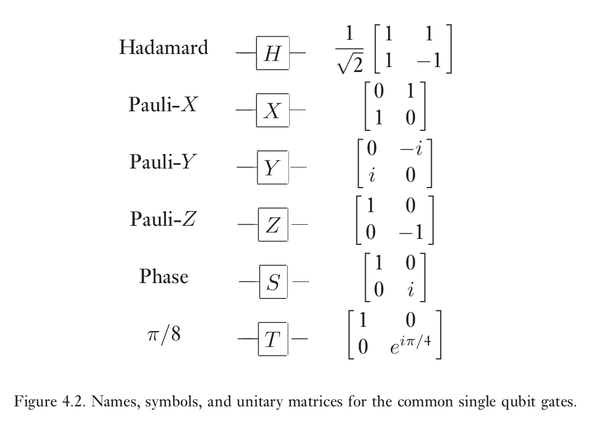
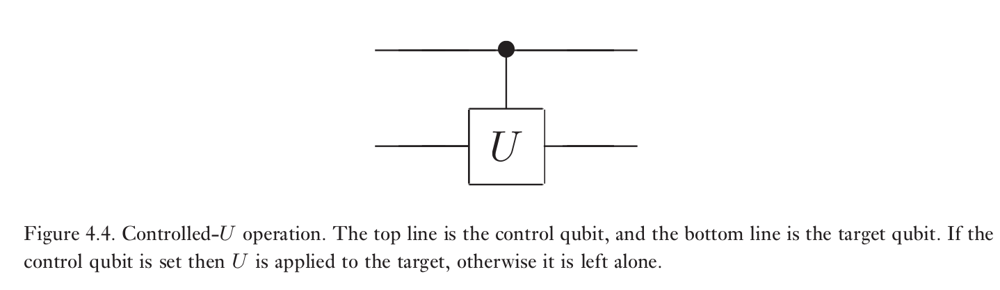
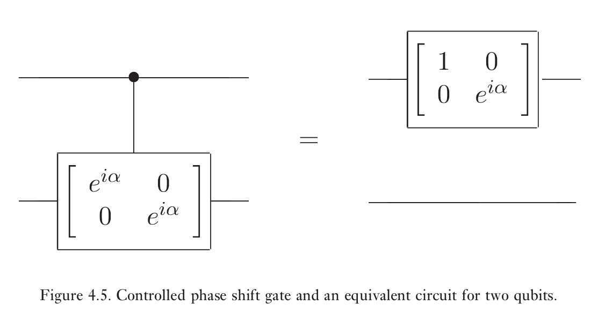
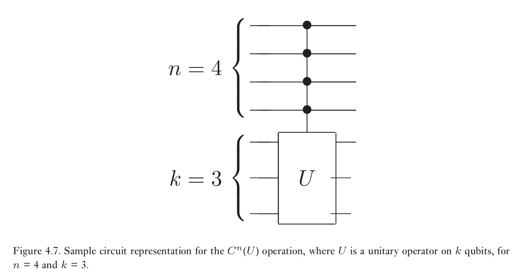
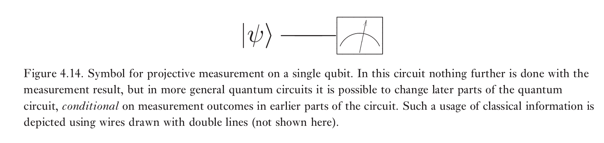
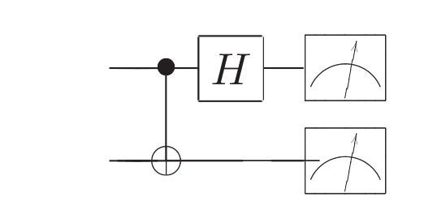
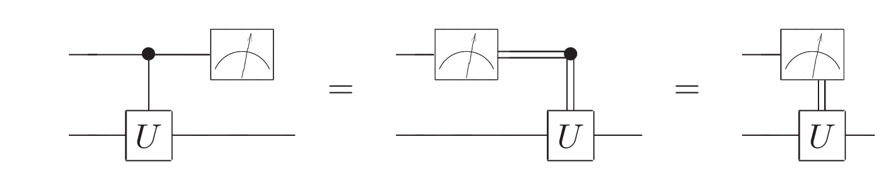
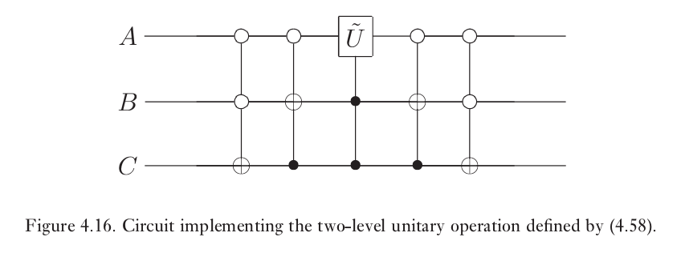

## 量子算法

## 单量子比特操作

Pauli矩阵
$$
X \equiv\left[\begin{array}{ll}{0} & {1} \\ {1} & {0}\end{array}\right] ; \quad Y \equiv\left[\begin{array}{cc}{0} & {-i} \\ {i} & {0}\end{array}\right] ; \quad Z \equiv\left[\begin{array}{cc}{1} & {0} \\ {0} & {-1}\end{array}\right]
$$

Hadamared门，相位门，$$\pi/8$$门

$$
H=\frac{1}{\sqrt{2}}\left[\begin{array}{cc}{1} & {1} \\ {1} & {-1}\end{array}\right] ; \quad S=\left[\begin{array}{cc}{1} & {0} \\ {0} & {i}\end{array}\right] ; \quad T=\left[\begin{array}{cc}{1} & {0} \\ {0} & {\exp (i \pi / 4)}\end{array}\right]
$$

$$
T=\exp (i \pi / 8)\left[\begin{array}{cc}{\exp (-i \pi / 8)} & {0} \\ {0} & {\exp (i \pi / 8)}\end{array}\right]
$$

关于$$\hat{x},\hat{y},\hat{z}$$的旋转算符
$$
\begin{array}{l}{R_{x}(\theta) \equiv e^{-i \theta X / 2}=\cos \frac{\theta}{2} I-i \sin \frac{\theta}{2} X=\left[\begin{array}{cc}{\cos \frac{\theta}{2}} & {-i \sin \frac{\theta}{2}} \\ 
{-i \sin \frac{\theta}{2}} & {\cos \frac{\theta}{2}}\end{array}\right]} \\ 
{R_{y}(\theta) \equiv e^{-i \theta Y / 2}=\cos \frac{\theta}{2} I-i \sin \frac{\theta}{2} Y=\left[\begin{array}{cc}{\cos \frac{\theta}{2}} & {-\sin \frac{\theta}{2}} \\ 
{\sin \frac{\theta}{2}} & {\cos \frac{\theta}{2}}\end{array}\right]} \\
{R_{z}(\theta)}  {\equiv e^{-i \theta Z / 2}=\cos \frac{\theta}{2} I-i \sin \frac{\theta}{2} Z=\left[\begin{array}{cc}{e^{-i \theta / 2}} & {0} \\
{0} & {e^{i \theta / 2}}\end{array}\right]}\end{array}
$$
上式由
$$
\exp (i A x)=\cos (x) I+i \sin (x) A
$$
可得。
$$
R_{\hat{n}}(\theta) \equiv \exp (-i \theta \hat{n} \cdot \vec{\sigma} / 2)=\cos \left(\frac{\theta}{2}\right) I-i \sin \left(\frac{\theta}{2}\right)\left(n_{x} X+n_{y} Y+n_{z} Z\right)
$$
任意单量子比特算符可以写为如下形式
$$
U=\exp (i \alpha) R_{\hat{n}}(\theta)
$$

$$
U=e^{i \alpha} R_{z}(\beta) R_{y}(\gamma) R_{z}(\delta)
$$

$$
U=e^{i \alpha} R_{\hat{n}}(\beta) R_{\hat{m}}(\gamma) R_{\hat{n}}(\delta)
$$

若U为单比特酉变换门，则存在满足$$ABC=I$$的单量子比特酉算符使得
$$
U=e^{i \alpha} A X B X C
$$

## 受控操作符

受控操作的一个典型为受控非 C-NOT
$$
|c\rangle|t\rangle \rightarrow|c\rangle|t \oplus c\rangle
$$
在计算基$$|control,target\rangle$$下，CNOT的矩阵表示为
$$
\left[\begin{array}{llll}{1} & {0} & {0} & {0} \\ {0} & {1} & {0} & {0} \\ {0} & {0} & {0} & {1} \\ {0} & {0} & {1} & {0}\end{array}\right]
$$

类似的，控制U变换
$$
|c\rangle|t\rangle \rightarrow|c\rangle U^{c}|t\rangle
$$

### 怎样实施controlled-U变换

#### 单比特控制门

仅需使用单比特操作门和CNOT门

该过程基于分解
$$
U=e^{i \alpha} A X B X C
$$

1. 实现受控相位变换
   $$
   |00\rangle \rightarrow|00\rangle, \quad|01\rangle \rightarrow|01\rangle, \quad|10\rangle \rightarrow e^{i \alpha}|10\rangle, \quad|11\rangle \rightarrow e^{i \alpha}|11\rangle
   $$

2. 实现受控U变换

   

#### 多比特控制门

$$
C^{n}(U)\left|x_{1} x_{2} \ldots x_{n}\right\rangle|\psi\rangle=\left|x_{1} x_{2} \ldots x_{n}\right\rangle U^{x_{1} x_{2} \ldots x_{n}}|\psi\rangle
$$

任意酉变换可以用Hadamard，相位，CNOT和$$\pi/8$$门进行任意精度要求的近似

$$C^{n}(U)$$

$$
\begin{aligned} C X_{1} C &=X_{1} X_{2} \\
C Y_{1} C &=Y_{1} X_{2} \\
C Z_{1} C &=Z_{1} \\
C X_{2} C &=X_{2} \\
C Y_{2} C &=Z_{1} Y_{2} \\
C Z_{2} C &=Z_{1} Z_{2} \\ 
R_{z, 1}(\theta) C &=C R_{z, 1}(\theta) \\
R_{x, 2}(\theta) C &=C R_{x, 2}(\theta) \end{aligned}+
$$

## 测量

几乎无可质疑，量子线路中的最后一个元素便是测量。我们用表的符号表示测量基上的投影测量

量子线路中有两条重要的原理

1. 经典条件操作可以用量子条件操作替代：推迟测量原理：测量总是可以从量子线路的中间过程移到线路的末尾；如果线路的任何过程用到测量结果，那么经典受控操作可以用量子受控操作替代
2. 隐测量原理：不失一般性，任何未封端的量子线（未被测量的量子比特）可以假设被测量。

一般认为测量是一个不可逆的过程，它破坏了量子信息，代之以经典信息。然而在一些精心设计的情况下，这也不是必然发生的。测量要可逆，它必须不揭示被测量子态的任何信息。

测量一般默认在计算基下测量，但我们经常需要在其他基下测量，此时我们只需要进行一个酉变换将我们所需的基变换到计算基下即可。例如

进行Bell态基矢下的测量

当被测量的量子比特是控制量子比特时，测量和量子门对易

## 通用量子门

如果用一组门的量子线路可以以任意精度近似任意的酉运算,则称这组门对量子计算是通用的。

### 二级酉门是通用的

考虑一个作用在d维希尔伯特空间上的酉矩阵U。在本节，我们将解释怎样将U分解为二级酉矩阵的乘积。二级酉矩阵即只对两个或更少向量元素有着非平凡作用的酉矩阵。

以三阶酉矩阵为例
$$
U=\left[\begin{array}{lll}{a} & {d} & {g} \\ {b} & {e} & {h} \\ {c} & {f} & {j}\end{array}\right]
$$
我们将寻找二级酉矩阵$$U_{1}, \ldots, U_{3}$$使得
$$
U_{3} U_{2} U_{1} U=I
$$
因此
$$
U=U_{1}^{\dagger} U_{2}^{\dagger} U_{3}^{\dagger}
$$
因为$$U_{1},U_{2},U_{3}$$都是二级酉矩阵，$$U_{1}^{\dagger} ,U_{2}^{\dagger} ,U_{3}^{\dagger}$$也为二级酉矩阵

下面开始构建这些矩阵

如果$$b=0$$，那么令
$$
U_{1} \equiv\left[\begin{array}{lll}{1} & {0} & {0} \\ {0} & {1} & {0} \\ {0} & {0} & {1}\end{array}\right]
$$
如果$$b\neq 0$$，那么令
$$
U _{1} \equiv
\left[
\begin{array}{ccc}
\frac{a^ *}{\sqrt{|a|^2+|b|^2}} & \frac{b^ *}{\sqrt{|a|^2+|b|^2}} & 0 \\
\frac{b}{\sqrt{|a|^2+|b|^2}} & \frac{-a}{\sqrt{|a|^{2}+|b|^{2}}} & 0 \\ 
0 & 0 & 1
\end{array}
\right]
$$

我们得到

$$
U_{1} U=\left[\begin{array}{ccc}{a^{\prime}} & {d^{\prime}} & {g^{\prime}} \\
{0} & {e^{\prime}} & {h^{\prime}} \\
{c^{\prime}} & {f^{\prime}} & {j^{\prime}}\end{array}\right]
$$

类似的，如果$$c'=0$$，那么令

$$
U_{2} \equiv\left[\begin{array}{lll}{a^{\prime *}} & {0} & {0} \\
{0} & {1} & {0} \\
{0} & {0} & {1}\end{array}\right]
$$

如果$$c'\neq0$$，那么令

$$
U_{2} \equiv\left[\begin{array}{ccc}{\frac{a^{\prime *}}{\sqrt{\left|a^{\prime}\right|^{2}+\left|c^{\prime}\right|^{2}}}} & {0} & {\frac{c^{\prime *}}{\sqrt{\left|a^{\prime}\right|^{2}+\left|c^{\prime}\right|^{2}}}} \\
{0} & {1} & {0} \\
{\frac{c^{\prime}}{\sqrt{\left|a^{\prime}\right|^{2}+\left|c^{\prime}\right|^{2}}}} & {0} & {\frac{-a^{\prime}}{\sqrt{\left|a^{\prime}\right|^{2}+\left|c^{\prime}\right|^{2}}}}\end{array}\right]
$$

这样我们得到

$$
U_{2} U_{1} U=\left[\begin{array}{ccc}{1} & {d^{\prime \prime}} & {g^{\prime \prime}} \\
{0} & {e^{\prime \prime}} & {h^{\prime \prime}} \\
{0} & {f^{\prime \prime}} & {j^{\prime \prime}}\end{array}\right]
$$

因为$$U,U_1,U_2$$为酉矩阵，所以$$U_{2} U_{1} U$$也为酉矩阵，所以$$d^{\prime \prime}=g^{\prime \prime}=0$$

最后令

$$
U_{3} \equiv\left[\begin{array}{ccc}{1} & {0} & {0} \\
{0} & {e^{n *}} & {f^{\prime \prime *}} \\
{0} & {h^{\prime \prime *}} & {j^{\prime \prime *}}\end{array}\right]
$$

更一般的，对于d维的情况，类似的，我们也可以找到二级酉矩阵$$U_{1}, \ldots, U_{d-1}$$使得左上角的元素为1，第一行以及第一列的其他元素均为0。对于d-1维矩阵重复该过程，最终我们可以得到任意$$d\times d$$酉矩阵可以写为

$$
U=V_{1} \ldots V_{k}
$$

这里$$V_i$$是二级酉矩阵并且$$k \leq(d-1)+(d-2)+\cdots+1=d(d-1)/2$$

上述结果的一个推论为n比特的任何一个酉矩阵可以写成最多$$2^{n-1}\left(2^{n}-1\right)$$个二级酉矩阵的乘积

### 单量子比特和CNOT门是通用的

单量子比特门和CNOT门组合在一起可以用来实现任意一个n量子比特的态空间中二级酉操作。

假设U是n量子比特量子计算机上的一个二级酉矩阵。假设U非平凡地作用在计算基$$|s\rangle$$和$$|t\rangle$$张成的空间上。

其中$$s=s_{1} \dots s_{n}$$,$$t=t_{1} \dots t_{n}$$是s和t的二进制展开。令$$\tilde{U}$$为U的非平凡$$2\times 2$$酉子矩阵；$$\tilde{U}$$可以认为是单个量子比特的酉算符。

我们将通过格雷码，仅利用单量子比特门和CNOT门构建线路实现U

令$$g_1$$到$$g_m$$为连接s到t的格雷码，$$g_1=s$$,$$g_m=t$$

实施U的过程为依次进行操作使得$$|g_{1}\rangle \rightarrow|g_{2}\rangle \rightarrow \ldots \rightarrow|g_{m-1}\rangle$$,然后实施$$C-\tilde{U}$$操作，目标比特为$$g_{m-1}$$和$$g_m$$不同的单个比特，然后逆向操作第一步，$$\left|g_{m-1}\right\rangle \rightarrow\left|g_{m-2}\right\rangle \rightarrow \ldots \rightarrow\left|g_{1}\right\rangle$$

例如我们想要实现如下二级酉变换
$$
U=\left[\begin{array}{llllllll}{a} & {0} & {0} & {0} & {0} & {0} & {0} & {c} \\ {0} & {1} & {0} & {0} & {0} & {0} & {0} & {0} \\ {0} & {0} & {1} & {0} & {0} & {0} & {0} & {0} \\ {0} & {0} & {0} & {1} & {0} & {0} & {0} & {0} \\ {0} & {0} & {0} & {0} & {1} & {0} & {0} & {0} \\ {0} & {0} & {0} & {0} & {0} & {1} & {0} & {0} \\ {0} & {0} & {0} & {0} & {0} & {0} & {1} & {0} \\ {b} & {0} & {0} & {0} & {0} & {0} & {0} & {d}\end{array}\right]
$$
这里a,b,c,d为任意复数使得$$\tilde{U} \equiv\left[\begin{array}{ll}{a} & {c} \\ {b} & {d}\end{array}\right]$$为一个酉矩阵

注意到U只对$$|000\rangle$$和$$|111\rangle$$有着非平凡的作用，格雷码如下
$$
\begin{array}{ccc}{A} & {B} & {C} \\ {0} & {0} & {0} \\ {0} & {0} & {1} \\ {0} & {1} & {1} \\ {1} & {1} & {1}\end{array}
$$
线路图如下

该方法用于n量子比特的任意酉操作需要$$O(n^24^n)$$单量子比特门和CNOT门

有接近最优的方案需要指数的门

### 通用操作的分立集

#### 近似酉算符

当使用V代替U时定义误差如下
$$
E(U, V) \equiv \max _{|\psi\rangle} \Vert(U-V)|\psi\rangle \Vert
$$
这里的最大值是针对所有归一化的量子态$$|\psi \rangle$$

如果$$E(U,V)$$足够小，那么任何作用在态$$V|\psi\rangle$$上的测量都将给出与作用在态$$U|\psi\rangle$$上近似相同的测量结果统计。
$$
\left|P _{U}-P _{V}\right| \leq 2 E(U, V)
$$

如果用一系列门$$V_{1}, \ldots, V_{m}$$近似一些其他的门序列$$U_{1}, \ldots, U_{m}$$,那么误差最多线性叠加
$$
E\left(U_{m} U_{m-1} \ldots U_{1}, V_{m} V_{m-1} \ldots V_{1}\right) \leq \sum_{j=1}^{m} E\left(U_{j}, V_{j}\right)
$$
$$\left|P _{U}-P _{V}\right| \leq 2 E(U, V)$$的证明如下

假设一个量子体系初始处于$$|\psi\rangle$$态，我们将对其进行酉操作U或V.令M为一个与测量相联系的POVM元素，那么
$$
\left|P_{U}-P_{V}\right|=\left|\left\langle\psi\left|U^{\dagger} M U\right| \psi\right\rangle-\left\langle\psi\left|V^{\dagger} M V\right| \psi\right\rangle\right|
$$
令$$|\Delta\rangle \equiv(U-V)|\psi\rangle$$那么
$$
\begin{aligned}\left|P_{U}-P_{V}\right| &=\left|\left\langle\psi\left|U^{\dagger} M\right| \Delta\right\rangle+\langle\Delta|M V| \psi\rangle\right| \\ & \leq\left|\left\langle\psi\left|U^{\dagger} M\right| \Delta\right\rangle\right|+|\langle\Delta|M V| \psi\rangle| \\ & \leq \||\Delta\rangle\|+\||\Delta\rangle \| \\ & \leq 2 E(U, V) \end{aligned}
$$
对于
$$
E\left(U_{m} U_{m-1} \ldots U_{1}, V_{m} V_{m-1} \ldots V_{1}\right) \leq \sum_{j=1}^{m} E\left(U_{j}, V_{j}\right)
$$
以$$m=2$$为例
$$
\begin{aligned} E\left(U_{2} U_{1}, V_{2} V_{1}\right) &=\|\left(U_{2} U_{1}-V_{2} V_{1}\right)|\psi\rangle \| \\ &=\|\left(U_{2} U_{1}-V_{2} U_{1}\right)|\psi\rangle+\left(V_{2} U_{1}-V_{2} V_{1}\right)|\psi\rangle \| \end{aligned}
$$

$$
\begin{aligned} E\left(U_{2} U_{1}, V_{2} V_{1}\right) & \leq \|\left(U_{2}-V_{2}\right) U_{1}|\psi\rangle\|+\| V_{2}\left(U_{1}-V_{1}\right)|\psi\rangle \| \\ & \leq E\left(U_{2}, V_{2}\right)+E\left(U_{1}, V_{1}\right) \end{aligned}
$$

#### Hadamard门、相位门、CNOT门和$$\pi/8$$门的通用性

##### Hadamard门和$$\pi/8$$门可以用来近似任意单量子比特酉变换到任意精度

考虑T门和HTH门。T门除了一个无关紧要的全局相因子之外相当于在Bloch球上绕$$\hat{z}$$轴旋转$$\pi/4$$,HTH门相当于在Bloch球上绕$$\hat{x}$$轴旋转$$\pi/4$$。两个加起来
$$
\begin{aligned} \exp \left(-i \frac{\pi}{8} Z\right) \exp \left(-i \frac{\pi}{8} X\right) &=\left[\cos \frac{\pi}{8} I-i \sin \frac{\pi}{8} Z\right]\left[\cos \frac{\pi}{8} I-i \sin \frac{\pi}{8} X\right] \\ &=\cos ^{2} \frac{\pi}{8} I-i\left[\cos \frac{\pi}{8}(X+Z)+\sin \frac{\pi}{8} Y\right] \sin \frac{\pi}{8} \end{aligned}
$$
这是在Bloch球上绕轴$$\vec{n}=\left(\cos \frac{\pi}{8}, \sin \frac{\pi}{8}, \cos \frac{\pi}{8}\right)$$旋转$$\theta$$,$$\theta$$满足$$\cos (\theta / 2) \equiv \cos ^{2} \frac{\pi}{8}$$.这样，仅用Hadamard门和$$\pi/8$$门我们可以构造$$R_{\hat{n}}(\theta)$$.显然$$\theta$$不是$$\pi$$的有理数倍。重复进行$$R_{\hat{n}}(\theta)$$可以近似到任意精度

对于任意的$$\epsilon$$,存在n使得
$$
E\left(R_{\hat{n}}(\alpha), R_{\hat{n}}(\theta)^{n}\right)<\frac{\epsilon}{3}
$$
现在验证任意单量子比特操作可以用Hadamard门和$$\pi/8$$门近似到任意精度
$$
H R_{\hat{n}}(\alpha) H=R_{\hat{m}}(\alpha)
$$
$$\hat{m}$$是$$\left(\cos \frac{\pi}{8},-\sin \frac{\pi}{8}, \cos \frac{\pi}{8}\right)$$方向上的单位向量
$$
E\left(R_{\hat{m}}(\alpha), R_{\hat{m}}(\theta)^{n}\right)<\frac{\epsilon}{3}
$$

$$
U=R_{\hat{n}}(\beta) R_{\hat{m}}(\gamma) R_{\hat{n}}(\delta)
$$

$$
E\left(U, R_{\hat{n}}(\theta)^{n_{1}} H R_{\hat{n}}(\theta)^{n_{2}} H R_{\hat{n}}(\theta)^{n_{3}}\right)<\epsilon
$$

##### Solovay-Kitaev定理

任意一个单量子比特门可以用这些分立门近似到$$\epsilon$$所需要的门的个数为$$O\left(\log ^{c}(1 / \epsilon)\right)$$个。其中c为近似为2的常数

因此近似包含m个CNOT门和单量子比特门的线路到$$\epsilon$$需要$$O\left(m\log ^{c}(m / \epsilon)\right)$$个门

### 近似任意酉门一般是困难的

存在n量子比特的态需要$$\Omega\left(2^{n} \log (1 / \epsilon) / \log (n)\right)$$步操作近似到距离为$$\epsilon$$

### 量子计算复杂度

BQP 是一类必要的量子复杂度集。它由可以用多项式规模的量子线路在有限概率误差内解决的决定性问题组成。
$$
BPP\subseteq \mathrm{BQP} \subseteq \mathrm{PSPACE}
$$

量子计算机可以用无限时间和空间资源解决的问题集不会大于可以用经典计算机解决的问题集。换句话说，量子计算机没有违背Church-Turing论题，任何算法过程都可以用图灵机有效模拟。当然，量子计算机可能更有效得多，因此挑战了强Church-Turing论题，任何算法过程都可以用概率图灵机有效模拟

## 量子计算的线路模型总结

量子计算线路模型的关键元素

1. 经典资源：一些部分如果使用经典资源将会更简单

2. 合适的态空间：量子线路作用在一些，n，量子比特上。态空间为$$2^n$$维复希尔伯特空间。直积态$$|x_1,\dots,x_n\rangle$$叫做计算机的计算基态。其中$$x_i=0,1$$。$$|x\rangle$$标记一个计算基态，$$x$$的二进制表示为$$x_1\dots x_n$$

3. 制备态到计算基态的能力：假设任意计算基态$$|x_1,\dots,x_x\rangle$$可以最多通过$$n$$步制备

4. 实施量子门操作的能力

5. 进行计算基测量的能力

   ## 模拟量子体系

### 行为模拟

模拟的核心是物理定律微分方程的解。这些解经常是近似解。然而，并非所有动态系统可以被有效模拟。一般来说，只有那些可以被有效描述的系统才可以被有效模拟

模拟量子体系的主要挑战是必须解指数增长数量的微分方程组